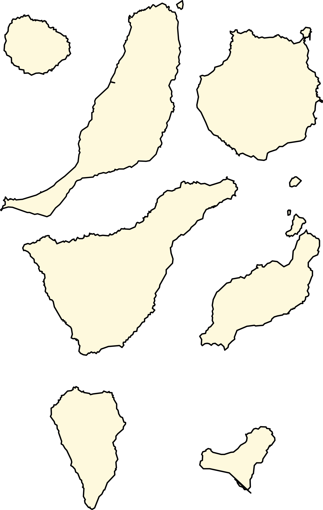

# [fit] Round 1

---

# 1. What are the native people of the canary islands called? 

---

# 2. What's the tech company from the movie Office Space called?

---

# 3. Who built the first compiler? 

---

# 4. When is there no standing at a stand up meeting?

---

# 5. Which city has the best climate in world? 

---

# 6. What's white, rectangular and used for drawing?

---

# 7. Band name, year of movie which made it famous

---

# 8. What are these islands' names?

---

# 9. Scrabble 
# [fit] ISUCOSDER
